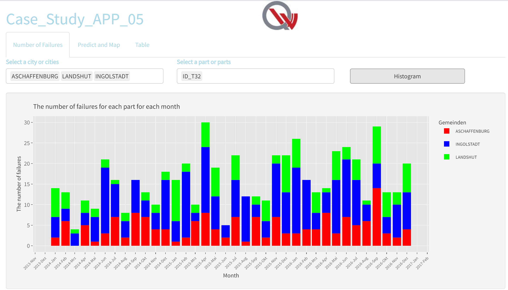
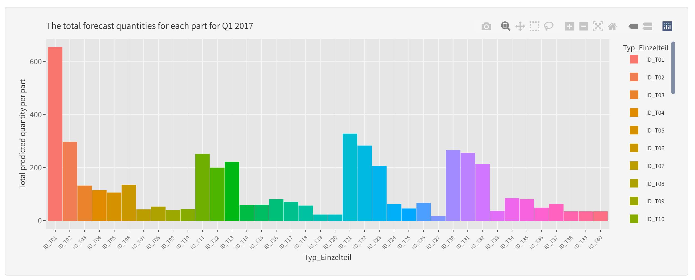
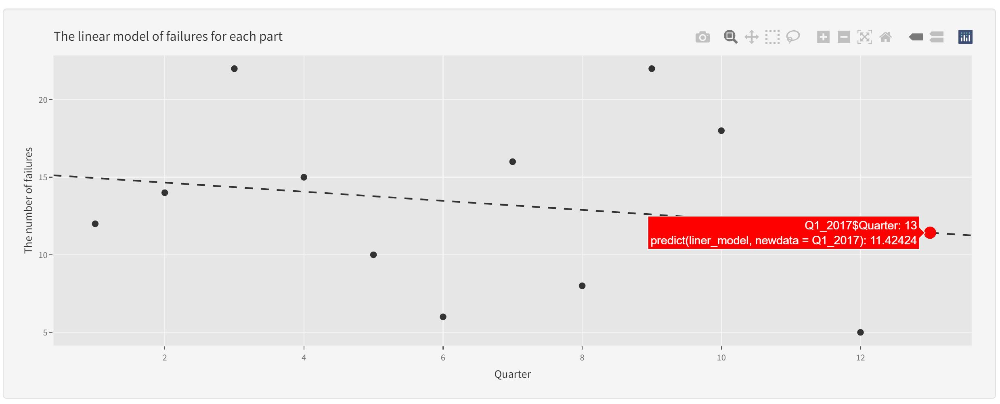
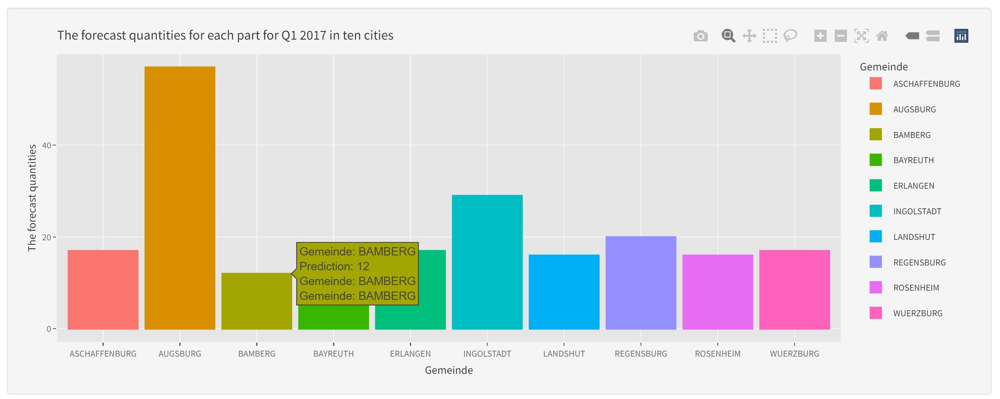
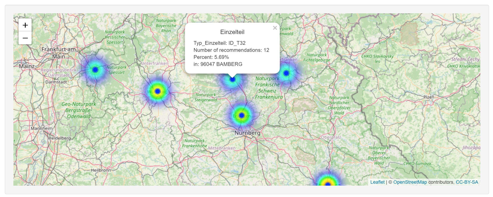
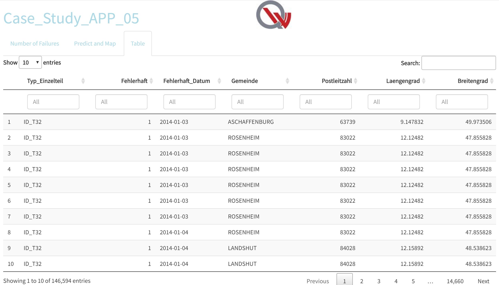

# Main briefing

You work in a chain of auto repair shops in Bavaria. You operate
workshops in the cities of Augsburg, Ingolstadt, Regensburg, Würzburg,
Bamberg, Bayreuth, Aschaffenburg, Erlangen, Rosenheim and Landshut.
Analyze the data from the last three years (2014 - 2016 inclusive).
Based on your analysis, make a recommendation to each repair shop on how
much of which part should be delivered to each repair shop.

Furthermore: - A vehicles with defects were repaired in the city where
they were registered - A vehicle is always considered to be defective if
an installed individual part, an installed component or the entire
vehicle is marked as defective - Data sets with vehicles, components and
parts information, also registration data and geodata, are stored in the
given data-base order. - The categories of data sets are listed below:
Single Part = Einzelteil Component = Komponente Vehicle = Fahrzeug
Geodata = Geodaten Registrations = Zulassungen Logistics delay =
Logistikverzug

# Procedure of the case study

## Install required Packages

According to used commands, install and load necessary packages.

```{r setup, include = FALSE, class.source = 'fold-hide'}
knitr::opts_chunk$set(comment = "> ", echo = TRUE, fig.width = 12)

knit_print.data.frame = function(x, ...) {
  res = paste(c("", "", knitr::kable(x)), collapse = "\n")
  knitr::asis_output(res)
}

# set cran mirror for package installs
local({r <- getOption("repos")
  r["CRAN"] <- "http://cran.r-project.org" 
  options(repos=r)
})

```

```{r libraries, message = FALSE, warning = FALSE}

if(!require(rmdformats)){
  install.packages("rmdformats")
}
library(rmdformats)

if(!require(prettydoc)){
  install.packages("prettydoc")
}
library(prettydoc)

if(!require(kableExtra)){
  install.packages("kableExtra")
}
library(kableExtra)

if (requireNamespace("thematic")) 
  thematic::thematic_rmd(font = "auto")   

if(!require(install.load)){
  install.packages("install.load")
}
library(install.load)

if(!require(tidyverse)){
  install.packages("tidyverse")
}
library(tidyverse)

if(!require(knitr)){
  install.packages("knitr")
}
library(knitr)

if(!require(reader)){
  install.packages("reader")
}
library(reader)

if (!require(DT)) {
  install.packages("DT")
}
library(DT)

if (!require(plotly)) {
  install.packages("plotly")
}
library(plotly)

if (!require(scales)) {
  install.packages("scales")
}
library(scales)

if (!require(stringr)) {
  install.packages("stringr")
}
library(stringr)

if (!require(ggplot2)) {
  install.packages("ggplot2")
}
library(ggplot2)

if (!require(RJSONIO)) {
  install.packages("RJSONIO")
}
library(RJSONIO)

if (!require(dplyr)) {
  install.packages("dplyr")
}
library(dplyr)

if (!require(leaflet)) {
  install.packages("leaflet")
}
library(leaflet)

if (!require(leaflet.extras)) {
  install.packages("leaflet.extras")
}
library(leaflet.extras)

if (!require(lubridate)) {
  install.packages("lubridate")
}
library(lubridate)

if (!require(forecast)) {
  install.packages("forecast")
}
library(forecast)

if (!require(padr)) {
  install.packages("padr")
}
library(padr)

if (!require(tidyquant)) {
  install.packages("tidyquant")
}
library(tidyquant)

if (!require(timetk)) {
  install.packages("timetk")
}
library(timetk)

if (!require(data.table)) {
  install.packages("data.table")
  require(data.table)
}
library(data.table)
```

## Import

### Registrations directory

We set a list with cities we operate in as repair shop owner. During the
procedure we switch between the directory's. For that reason we keep
each path as character string.

```{r importCities, message = FALSE, warning = FALSE}
Cities <- sort(c("AUGSBURG", "INGOLSTADT", "REGENSBURG", "WUERZBURG", "BAMBERG", 
            "BAYREUTH", "ASCHAFFENBURG", "ERLANGEN", "ROSENHEIM", "LANDSHUT"))

Imported_Files      <- c()
Current_Path        <- getwd()

Path_Parts          <- "./Data/Einzelteil/"
Path_Groups         <- "./Data/Komponente/"
Path_Vehicle        <- "./Data/Fahrzeug/"
Path_Registrations  <- "./Data/Zulassungen/"
Path_Geodata        <- "./Data/Geodaten/"
Path_LogisticsDelay <- "./Data/Logistikverzug/"

```

Geodata are used to show the localization of the repair shops on the
map.

```{r importGeodata, message = FALSE, warning = FALSE}
setwd(Path_Geodata)
Geodata <- read_csv2("Geodaten_Gemeinden_v1.2_2017-08-22_TrR.csv", col_types = "dddccc")
Geodata <- dplyr::select(Geodata, -1, -2)

head(Geodata)
```

Import data from the Registrations directory. For later analysis create
a set of registration-ID´s, from cities we have an repairshop in. We
also checked all locations for failures like case inconsistency or
grammar failures, after grouping them by "Gemeinden".

```{r importRegistrations, message = FALSE, warning = FALSE}
# get into targetpath:
setwd(Path_Registrations)
Imported_IDs              <- c("Registrations_Data")
Imported_Files            <- append(Imported_Files, c(Imported_IDs))
# Make a list of main groups of data-types:
Files_txt                 <- list.files(pattern = ("*.txt"))
Files_csv                 <- list.files(pattern = ("*.csv"))

Registrations_Data        <- read_csv2(Files_csv, col_types = "dccD")

# Check the correctness of the names manually:
Cities_Summary            <- dplyr::count(Registrations_Data, Gemeinden)

# Make a summary in each interested city for better understanding of the data:
Cars_Registered_Grouped   <- group_by(Registrations_Data, Gemeinden)

# Save interested ID´s for further exploration:
# IDNumbers_Vector           <- sort(pull(Cars_Registered_Grouped, IDNummer))   
IDNumbers_Vector           <- Cars_Registered_Grouped %>% 
                          filter(Gemeinden %in% Cities) %>% 
                          pull(IDNummer)

# How much registrations in each of our cities exists:
Cars_Registered_Summary   <- Cars_Registered_Grouped %>% 
                          filter(Gemeinden %in% Cities) %>% 
                          count("Gemeinden")
print(Cars_Registered_Summary)
```

### Vehicle directory

This Path had 8 csv-files - 4 with relations tables and 4 sets with data
about specific vehicles. All of them has csv-type could be imported with
read_delim().

```{r importVehicles, message = FALSE, warning = FALSE, results = 'asis', cache = TRUE}
# get into target-path:
setwd(Path_Vehicle)
Imported_Vehicles <- c("Relations_Data_11", "Relations_Data_12", "Relations_Data_21", "Relations_Data_22",
                       "Vehicle_Data_11", "Vehicle_Data_12", "Vehicle_Data_21", "Vehicle_Data_22")
#Imported_Files <- append(Imported_Files, Imported_Vehicles)

# Make a list of main groups of data-types:
Files_csv                 <- list.files(pattern = ("*.csv"))

Relations_Data_11         <- read_delim(Files_csv[1], col_types = "dccccc")

# Find out variable types
spec(Relations_Data_11)

Relations_Data_12         <- read_delim(Files_csv[2], col_types = "dccccc")
Relations_Data_21         <- read_delim(Files_csv[3], col_types = "dccccc")
Relations_Data_22         <- read_delim(Files_csv[4], col_types = "dccccc")

Vehicle_Data_11           <- read_delim(Files_csv[5], col_types = "ddcDdddDd")
Vehicle_Data_12           <- read_delim(Files_csv[6], col_types = "ddcDdddDd")
Vehicle_Data_21           <- read_delim(Files_csv[7], col_types = "ddcdddDddc")
Vehicle_Data_22           <- read_delim(Files_csv[8], col_types = "ddcdddDddc")

# Filter on this point to thin out the data.
filter_by_ID <- function(data, ID) {
  data <- data %>% filter(ID_Fahrzeug %in% ID)
  return(data)
}

# Make sure the Date Variable is set as "Date-Format"
Vehicle_Data_11$Fehlerhaft_Datum <- as.Date(Vehicle_Data_11$Fehlerhaft_Datum, 
                                            tryFormats = c("%Y-%m-%d", "%Y/%m/%d"))
Vehicle_Data_12$Fehlerhaft_Datum <- as.Date(Vehicle_Data_12$Fehlerhaft_Datum, 
                                            tryFormats = c("%Y-%m-%d", "%Y/%m/%d"))
Vehicle_Data_21$Fehlerhaft_Datum <- as.Date(Vehicle_Data_21$Fehlerhaft_Datum, 
                                            tryFormats = c("%Y-%m-%d", "%Y/%m/%d"))
Vehicle_Data_22$Fehlerhaft_Datum <- Vehicle_Data_22$Fehlerhaft_Datum %>% 
                                    as.Date(tryFormats = c("%Y-%m-%d", "%Y/%m/%d"))

```

### Components directory

Importing components: Data stored as string of characters in a txt-File
had different delimiters for rows and columns. We opened each to
determine the delimiters. The Procedure of importing data from txt is
read the content as a string and replace inconvenient separators with
ones can be detected by the fread()-function. Than we have a format of
string-data can be stored in a usual table or a tibble.

```{r importComponents, message = FALSE, warning = FALSE, cache = TRUE}
# get into targetpath:
setwd(Path_Groups)
Imported_Groups <- sort(c("Komponente_K1DI2", "Komponente_K2LE1", 
                         "Komponente_K2LE2", "Komponente_K2ST1", 
                         "Komponente_K3AG2", "Komponente_K7", 
                         "Komponente_K1BE1", "Komponente_K1BE2", 
                         "Komponente_K1DI1", "Komponente_K2ST2", 
                         "Komponente_K3AG1", "Komponente_K3SG1", 
                         "Komponente_K3SG2", "Komponente_K4", 
                         "Komponente_K5", "Komponente_K6",
                         "Bestandteile_Komponente_K1DI2", 
                         "Bestandteile_Komponente_K2LE1", 
                         "Bestandteile_Komponente_K2LE2", 
                         "Bestandteile_Komponente_K2ST1", 
                         "Bestandteile_Komponente_K3AG2", 
                         "Bestandteile_Komponente_K7", 
                         "Bestandteile_Komponente_K1BE1", 
                         "Bestandteile_Komponente_K1BE2", 
                         "Bestandteile_Komponente_K1DI1", 
                         "Bestandteile_Komponente_K2ST2", 
                         "Bestandteile_Komponente_K3AG1", 
                         "Bestandteile_Komponente_K3SG1", 
                         "Bestandteile_Komponente_K3SG2", 
                         "Bestandteile_Komponente_K4", 
                         "Bestandteile_Komponente_K5", 
                         "Bestandteile_Komponente_K6"))

Imported_Files <- append(Imported_Files, Imported_Groups)

# Make a list of main groups of data-types:
Files_txt                 <- list.files(pattern = ("*.txt"))
Files_csv                 <- list.files(pattern = ("*.csv"))

Sep_txt                   <- c(c("K1DI2", "\\\\", "\\t"), 
                          c("K2LE1", "II",   ""), 
                          c("K2LE2", "\\\\", "\\n"), 
                          c("K2ST1", "\\|",  "\\n"),
                          c("K3AG2", "\\\\", "\\n"),
                          c("K7",    "\\t",  "\\n"))

# import txt-files with VarNames as DataNames
Data_Name                 <- sub("*.txt", "", Files_txt[1])
Data_Group                <- read_file(Files_txt[1]) %>% 
                          gsub(pattern = "\\t", replacement = "\n") %>%
                          gsub(pattern = "\\\\", replacement = ";") %>%
                          fread()
do.call("<-", list(Data_Name, Data_Group)) 

Data_Name                 <- sub("*.txt", "", Files_txt[2])
Data_Group                <- read_file(Files_txt[2]) %>%
                          gsub(pattern = "", replacement = "\n") %>%
                          gsub(pattern = "II", replacement = ";") %>%
                          fread()
do.call("<-", list(Data_Name, Data_Group))

Data_Name                 <- sub("*.txt", "", Files_txt[3])
Data_Group                <- read_file(Files_txt[3]) %>% 
                          gsub(pattern = "\\n", replacement = "\n") %>%
                          gsub(pattern = "\\\\", replacement = ";") %>%
                          fread()
do.call("<-", list(Data_Name, Data_Group)) 

Data_Name                 <- sub("*.txt", "", Files_txt[4])
Data_Group                <- read_file(Files_txt[4]) %>% 
                          gsub(pattern = "\\n", replacement = "\n") %>%
                          gsub(pattern = "\\|", replacement = ";") %>%
                          fread()
do.call("<-", list(Data_Name, Data_Group)) 

Data_Name                 <- sub("*.txt", "", Files_txt[5])
Data_Group                <- read_file(Files_txt[5]) %>% 
                          gsub(pattern = "\\n", replacement = "\n") %>%
                          gsub(pattern = "\\\\", replacement = ";") %>%
                          fread()
do.call("<-", list(Data_Name, Data_Group)) 

Data_Name                 <- sub("*.txt", "", Files_txt[6])
Data_Group                <- read_file(Files_txt[6]) %>% 
                          gsub(pattern = "\\n", replacement = "\n") %>%
                          gsub(pattern = "\\t", replacement = ";") %>%
                          fread()
do.call("<-", list(Data_Name, Data_Group)) 

rm(Data_Group)

# Import all csv-Files from current path:
for (i in 1:length(Files_csv)) {
  Data_Name <- sub("*.csv", "", Files_csv[i])
  do.call("<-", list(Data_Name, read_delim(Files_csv[i], 
                                           show_col_types = FALSE)))
}

```

Importing Parts_Data: The parts Files contains of \*.csv' with ";" and
"," as separator. And \*.txt with random separators. File T22 and T35
has addition difficulties to import, because of Row Separator is an
empty char "" and the possibility that alphanumeric characters precede
and follows a double quoted value is possible in different cases.

```{r importParts, message = FALSE, warning = FALSE, cache = TRUE}
# Read Parts-Files from destination-directory
setwd(Path_Parts)
Files_txt       <- list.files(pattern = ("*.txt"))
Files_csv       <- list.files(pattern = ("*.csv"))
Imported_Parts  <- c("Einzelteil_T01", "Einzelteil_T02", "Einzelteil_T03", 
                    "Einzelteil_T04", "Einzelteil_T05", "Einzelteil_T06", 
                    "Einzelteil_T07", "Einzelteil_T08", "Einzelteil_T09", 
                    "Einzelteil_T10", "Einzelteil_T11", "Einzelteil_T12", 
                    "Einzelteil_T13", "Einzelteil_T14", "Einzelteil_T15", 
                    "Einzelteil_T16", "Einzelteil_T17", "Einzelteil_T18", 
                    "Einzelteil_T19", "Einzelteil_T20", "Einzelteil_T21", 
                    "Einzelteil_T22", "Einzelteil_T23", "Einzelteil_T24", 
                    "Einzelteil_T25", "Einzelteil_T26", "Einzelteil_T27", 
                    "Einzelteil_T30", "Einzelteil_T31", "Einzelteil_T32",
                    "Einzelteil_T33", "Einzelteil_T34", "Einzelteil_T35", 
                    "Einzelteil_T36", "Einzelteil_T37", "Einzelteil_T38", 
                    "Einzelteil_T39", "Einzelteil_T40")

# *.txt File als einen Character_string lesen
Einzelteil_T01 <- read_file(Files_txt[1]) %>% 
                  gsub(rep = ";", pattern = " \\| \\| ") %>% 
                  gsub(rep = "\n", pattern = " ") %>% 
                  fread()

Einzelteil_T02 <- read_file(Files_txt[2]) %>% 
                  gsub(rep = ";", pattern = "  ") %>%
                  gsub(rep = "\n", pattern = "\\t") %>%
                  fread()

Einzelteil_T03 <- read_file(Files_txt[3]) %>%
                  gsub(rep = ";", pattern = "\\|") %>%
                  gsub(rep = "\n", pattern = "") %>%
                  fread()

Einzelteil_T07 <- read_file(Files_txt[4]) %>%
                  gsub(rep = "\"\n\"", pattern = "\"\"") %>%
                  gsub(rep = "\n", pattern = "") %>%
                  fread()

Einzelteil_T09 <- read_file(Files_txt[5]) %>%
                  gsub(rep = "\n", pattern = "") %>%
                  gsub(rep = ";", pattern = "\\\\") %>%
                  fread()

Einzelteil_T11 <- read_file(Files_txt[6]) %>%
                  gsub(rep = ";", pattern = "\\t") %>%
                  gsub(rep = "\n", pattern = "") %>%
                  fread()

Einzelteil_T16 <- read_file(Files_txt[7]) %>%
                  gsub(rep = ";", pattern = " \\| \\| ") %>%
                  gsub(rep = "\n", pattern = "\\t") %>%
                  fread()

Einzelteil_T20 <- read_file(Files_txt[8]) %>%
                  gsub(rep = ";", pattern = " \\| \\| ") %>%
                  gsub(rep = "\n", pattern = " ") %>%
                  fread()

Einzelteil_T22 <- read_file(Files_txt[9]) %>%
                  gsub(replacement = ";", pattern = "\\t") %>% 
                  gsub(replacement = "\"\n\"", pattern = "\"\"") %>% 
                  gsub(rep = "\\1\n\"\\3", pat = "([A0-9])(\")([^\";])") %>% 
                  fread()

Einzelteil_T24 <- read_file(Files_txt[10]) %>%
                  gsub(rep = ";", pattern = "  ") %>%
                  gsub(rep = "\n", pattern = "") %>%
                  fread()

Einzelteil_T27 <- read_file(Files_txt[11]) %>%
                  gsub(rep = ";", pattern = " \\| \\| ") %>%
                  gsub(rep = "\n", pattern = "") %>%
                  fread()

Einzelteil_T31 <- read_file(Files_txt[12]) %>%
                  gsub(rep = ";", pattern = "  ") %>%
                  gsub(rep = "\n", pattern = "") %>%
                  fread()

Einzelteil_T34 <- read_file(Files_txt[13]) %>%
                  gsub(rep = ";", pattern = " \\| \\| ") %>%
                  gsub(rep = "\"\n\"", pattern = "\"\"") %>%
                  fread()

Einzelteil_T35 <- read_file(Files_txt[14]) %>%
                  gsub(replacement = ";", pattern = "\\\\") %>% 
                  gsub(replacement = "\"\n\"", pattern = "\"\"") %>% 
                  gsub(rep = "\\1\n\"\\3", pat = "([A0-9])(\")([^\";])") %>% 
                  fread()

Einzelteil_T36 <- read_file(Files_txt[15]) %>%
                  gsub(rep = ";", pattern = "  ") %>%
                  gsub(rep = "\n", pattern = " ") %>%
                  fread()

Einzelteil_T39 <- read_file(Files_txt[16]) %>%
                  gsub(rep = ";", pattern = "\\\\") %>%
                  gsub(rep = "\n", pattern = "") %>%
                  fread()

# Import all csv-Files from current path:
for (i in 1:length(Files_csv)) {
  Data_Name <- sub("*.csv", "", Files_csv[i])
  do.call("<-", list(Data_Name, read_delim(Files_csv[i], 
                                           show_col_types = FALSE)))
}

Imported_Files <- append(Imported_Files, c(Imported_Parts))

```

## Data preparation

### Observing imported data sets

A glimpse() to the imported data shows, that several data frames have
unnecessary variables at the beginning. Like unnamed first column or in
some cases a variable X1. Both are from type numeric and probably used
as counting numbers. Since we have to restructure the complete frames
regarding period and location, this information would lost his
signification. All files for groups-tibbles have 2 unused vars on the
beginning. Groups relations-tibbles have 1 unused var, except K2ST1.
Examples for "Komponente_K1BE1", "Bestandteile_Komponente_K1BE1" and the
outstanding one "Bestandteile_Komponente_K2ST1":

```{r observeComponents, message = FALSE, warning = FALSE, collapse = TRUE}
glimpse(Komponente_K1BE1)
glimpse(Bestandteile_Komponente_K1BE1)
glimpse(Bestandteile_Komponente_K2ST1)

```

The frames for relations of the vehicle data have the same issue in the
first column and the imported parts respectively vehicle frames first
both variables with counting values. Here view examples for vehicle
relations, vehicle data and parts data.

```{r observeTab, message = FALSE, warning = FALSE, collapse = TRUE}
str(Relations_Data_11)
str(Vehicle_Data_11)
str(Einzelteil_T01)
```

### Bring data into consistent format

Delete first column used as counting number of rows.

```{r delNumRelations, message = FALSE, warning = FALSE}

Relations_Data_11 <- dplyr::select(Relations_Data_11, -1)
Relations_Data_12 <- dplyr::select(Relations_Data_12, -1)
Relations_Data_21 <- dplyr::select(Relations_Data_21, -1)
Relations_Data_22 <- dplyr::select(Relations_Data_22, -1)

```

Same reason: delete unecessary infirmation. For further automation in a
loop we call "\<-" as a function.

```{r delNumVehicle, message = FALSE, warning = FALSE}
do.call("<-", list("Vehicle_Data_11", dplyr::select(get("Vehicle_Data_11"), -1, -2)))
do.call("<-", list("Vehicle_Data_12", dplyr::select(get("Vehicle_Data_12"), -1, -2)))
do.call("<-", list("Vehicle_Data_21", dplyr::select(get("Vehicle_Data_21"), -1, -2)))
do.call("<-", list("Vehicle_Data_22", dplyr::select(get("Vehicle_Data_22"), -1, -2)))
```

Using iterative method, going trough the list with imported parts-data
frames, delete firs or first two columns with counting numbers.

```{r deNumPartCompRegis, message = FALSE, warning = FALSE}
# Delete counting Columns
for (i in 1:length(Imported_Parts)){
  do.call("<-", list(Imported_Parts[i], dplyr::select(get(Imported_Parts[i]), 
                                               -1, -2)))
}

# Same for components:
for (i in 1:length(Imported_Groups)){
  if (!is.null(grep("Bestand", Imported_Groups[i], invert = TRUE)) & 
      length(grep("Bestand", Imported_Groups[i], invert = TRUE)) == 0){
    do.call("<-", list(Imported_Groups[i], dplyr::select(get(Imported_Groups[i]), 
                                                  -1))) 
  } else {
    do.call("<-", list(Imported_Groups[i], dplyr::select(get(Imported_Groups[i]), 
                                                  -1, -2)))
  }
}

# Outstanding data frame as exception:
do.call("<-", list("Bestandteile_Komponente_K2ST1", 
                   dplyr::select(Bestandteile_Komponente_K2ST1, -1)))

Registrations_Data <- dplyr::select(Registrations_Data, -1)

```

Some of the tibbles have different rows containing one type of
information repeated once or twice. This variables have ".x" or ".y" as
additional suffix respectively.

```{r obsPart1, message = FALSE, warning = FALSE}
glimpse(Einzelteil_T01)

```

To fix this diversities we had to split the tibbles into two or three
parts, rename the repeated columns and bind this parts below each other
with rbind(). Some Tables had the double some tripple number of columns.
We observe each first and than handle this cases separately.

```{r splitPartComp, message = FALSE, warning = FALSE}

# observe data with 14 Variables:
Temp_01           <- dplyr::select(Einzelteil_T01, 1:7)
Temp_02           <- dplyr::select(Einzelteil_T01, 8:14)
colnames(Temp_01) <- gsub(x = colnames(Temp_01), pattern = "*\\.x", rep = "")
colnames(Temp_02) <- gsub(x = colnames(Temp_02), pattern = "*\\.y", rep = "")
Einzelteil_T01    <- dplyr::select(Einzelteil_T01, -c(1:14))
Einzelteil_T01    <- rbind(Einzelteil_T01, rbind(Temp_01, Temp_02))

Temp_01           <- dplyr::select(Einzelteil_T02, 1:7)
Temp_02           <- dplyr::select(Einzelteil_T02, 8:14)
colnames(Temp_01) <- gsub(x = colnames(Temp_01), pattern = "*\\.x", rep = "")
colnames(Temp_02) <- gsub(x = colnames(Temp_02), pattern = "*\\.y", rep = "")
Einzelteil_T02    <- rbind(Temp_01, Temp_02)

Temp_01           <- dplyr::select(Einzelteil_T05, 1:7)
Temp_02           <- dplyr::select(Einzelteil_T05, 8:14)
colnames(Temp_01) <- gsub(x = colnames(Temp_01), pattern = "*\\.x", rep = "")
colnames(Temp_02) <- gsub(x = colnames(Temp_02), pattern = "*\\.y", rep = "")
Einzelteil_T05    <- rbind(Temp_01, Temp_02)

Temp_01           <- dplyr::select(Einzelteil_T09, 1:7)
Temp_02           <- dplyr::select(Einzelteil_T09, 8:14)
colnames(Temp_01) <- gsub(x = colnames(Temp_01), pattern = "*\\.x", rep = "")
colnames(Temp_02) <- gsub(x = colnames(Temp_02), pattern = "*\\.y", rep = "")
Einzelteil_T09    <- rbind(Temp_01, Temp_02)

Temp_01           <- dplyr::select(Einzelteil_T15, 1:7)
Temp_02           <- dplyr::select(Einzelteil_T15, 8:14)
colnames(Temp_01) <- gsub(x = colnames(Temp_01), pattern = "*\\.x", rep = "")
colnames(Temp_02) <- gsub(x = colnames(Temp_02), pattern = "*\\.y", rep = "")
Einzelteil_T15    <- rbind(Temp_01, Temp_02)

Temp_01           <- dplyr::select(Einzelteil_T23, 1:7)
Temp_02           <- dplyr::select(Einzelteil_T23, 8:14)
colnames(Temp_01) <- gsub(x = colnames(Temp_01), pattern = "*\\.x", rep = "")
colnames(Temp_02) <- gsub(x = colnames(Temp_02), pattern = "*\\.y", rep = "")
Einzelteil_T23    <- rbind(Temp_01, Temp_02)

Temp_01           <- dplyr::select(Einzelteil_T32, 1:7)
Temp_02           <- dplyr::select(Einzelteil_T32, 8:14)
colnames(Temp_01) <- gsub(x = colnames(Temp_01), pattern = "*\\.x", rep = "")
colnames(Temp_02) <- gsub(x = colnames(Temp_02), pattern = "*\\.y", rep = "")
Einzelteil_T32    <- rbind(Temp_01, Temp_02)

Temp_01           <- dplyr::select(Einzelteil_T35, 1:7)
Temp_02           <- dplyr::select(Einzelteil_T35, 8:14)
colnames(Temp_01) <- gsub(x = colnames(Temp_01), pattern = "*\\.x", rep = "")
colnames(Temp_02) <- gsub(x = colnames(Temp_02), pattern = "*\\.y", rep = "")
Einzelteil_T35    <- rbind(Temp_01, Temp_02)

Temp_01           <- dplyr::select(Einzelteil_T38, 1:7)
Temp_02           <- dplyr::select(Einzelteil_T38, 8:14)
colnames(Temp_01) <- gsub(x = colnames(Temp_01), pattern = "*\\.x", rep = "")
colnames(Temp_02) <- gsub(x = colnames(Temp_02), pattern = "*\\.y", rep = "")
Einzelteil_T38    <- rbind(Temp_01, Temp_02)

Temp_01           <- dplyr::select(Einzelteil_T39, 1:7)
Temp_02           <- dplyr::select(Einzelteil_T39, 8:14)
colnames(Temp_01) <- gsub(x = colnames(Temp_01), pattern = "*\\.x", rep = "")
colnames(Temp_02) <- gsub(x = colnames(Temp_02), pattern = "*\\.y", rep = "")
Einzelteil_T39    <- rbind(Temp_01, Temp_02)

Data_Name         <- "Einzelteil_T12"
Temp_01           <- dplyr::select(get(Data_Name), 1:7)
Temp_02           <- dplyr::select(get(Data_Name), 8:14)
colnames(Temp_01) <- gsub(x = colnames(Temp_01), pattern = "*\\.x", rep = "")
colnames(Temp_02) <- gsub(x = colnames(Temp_02), pattern = "*\\.y", rep = "")
do.call("<-", list(Data_Name, dplyr::select(get(Data_Name), -c(1:14))))
do.call("<-", list(Data_Name, rbind(get(Data_Name), rbind(Temp_01, Temp_02))))

Data_Name         <- "Einzelteil_T16"
Temp_01           <- dplyr::select(get(Data_Name), 1:7)
Temp_02           <- dplyr::select(get(Data_Name), 8:14)
colnames(Temp_01) <- gsub(x = colnames(Temp_01), pattern = "*\\.x", rep = "")
colnames(Temp_02) <- gsub(x = colnames(Temp_02), pattern = "*\\.y", rep = "")
do.call("<-", list(Data_Name, dplyr::select(get(Data_Name), -c(1:14))))
do.call("<-", list(Data_Name, rbind(get(Data_Name), rbind(Temp_01, Temp_02))))

Data_Name         <- "Einzelteil_T17"
Temp_01           <- dplyr::select(get(Data_Name), 1:7)
Temp_02           <- dplyr::select(get(Data_Name), 8:14)
colnames(Temp_01) <- gsub(x = colnames(Temp_01), pattern = "*\\.x", rep = "")
colnames(Temp_02) <- gsub(x = colnames(Temp_02), pattern = "*\\.y", rep = "")
do.call("<-", list(Data_Name, dplyr::select(get(Data_Name), -c(1:14))))
do.call("<-", list(Data_Name, rbind(get(Data_Name), rbind(Temp_01, Temp_02))))

Data_Name         <- "Einzelteil_T22"
Temp_01           <- dplyr::select(get(Data_Name), 1:7)
Temp_02           <- dplyr::select(get(Data_Name), 8:14)
colnames(Temp_01) <- gsub(x = colnames(Temp_01), pattern = "*\\.x", rep = "")
colnames(Temp_02) <- gsub(x = colnames(Temp_02), pattern = "*\\.y", rep = "")
do.call("<-", list(Data_Name, dplyr::select(get(Data_Name), -c(1:14))))
do.call("<-", list(Data_Name, rbind(get(Data_Name), rbind(Temp_01, Temp_02))))

Data_Name         <- "Einzelteil_T24"
Temp_01           <- dplyr::select(get(Data_Name), 1:7)
Temp_02           <- dplyr::select(get(Data_Name), 8:14)
colnames(Temp_01) <- gsub(x = colnames(Temp_01), pattern = "*\\.x", rep = "")
colnames(Temp_02) <- gsub(x = colnames(Temp_02), pattern = "*\\.y", rep = "")
do.call("<-", list(Data_Name, dplyr::select(get(Data_Name), -c(1:14))))
do.call("<-", list(Data_Name, rbind(get(Data_Name), rbind(Temp_01, Temp_02))))

Data_Name         <- "Einzelteil_T30"
Temp_01           <- dplyr::select(get(Data_Name), 1:7)
Temp_02           <- dplyr::select(get(Data_Name), 8:14)
colnames(Temp_01) <- gsub(x = colnames(Temp_01), pattern = "*\\.x", rep = "")
colnames(Temp_02) <- gsub(x = colnames(Temp_02), pattern = "*\\.y", rep = "")
do.call("<-", list(Data_Name, dplyr::select(get(Data_Name), -c(1:14))))
do.call("<-", list(Data_Name, rbind(get(Data_Name), rbind(Temp_01, Temp_02))))


# Same procedure for the Groups data:
Data_Name         <- "Komponente_K1DI1"
Temp_01           <- dplyr::select(get(Data_Name), 1:7)
Temp_02           <- dplyr::select(get(Data_Name), 8:14)
colnames(Temp_01) <- gsub(x = colnames(Temp_01), pattern = "*\\.x", rep = "")
colnames(Temp_02) <- gsub(x = colnames(Temp_02), pattern = "*\\.y", rep = "")
do.call("<-", list(Data_Name, dplyr::select(get(Data_Name), -c(1:14))))
do.call("<-", list(Data_Name, rbind(get(Data_Name), rbind(Temp_01, Temp_02))))

Data_Name         <- "Komponente_K3AG1"
Temp_01           <- dplyr::select(get(Data_Name), 1:7)
Temp_02           <- dplyr::select(get(Data_Name), 8:14)
colnames(Temp_01) <- gsub(x = colnames(Temp_01), pattern = "*\\.x", rep = "")
colnames(Temp_02) <- gsub(x = colnames(Temp_02), pattern = "*\\.y", rep = "")
do.call("<-", list(Data_Name, dplyr::select(get(Data_Name), -c(1:14))))
do.call("<-", list(Data_Name, rbind(get(Data_Name), rbind(Temp_01, Temp_02))))


# Prepair of 14 rows
Data_Name         <- "Komponente_K2LE1"
Temp_01           <- dplyr::select(get(Data_Name), 1:7)
Temp_02           <- dplyr::select(get(Data_Name), 8:14)
colnames(Temp_01) <- gsub(x = colnames(Temp_01), pattern = "*\\.x", rep = "")
colnames(Temp_02) <- gsub(x = colnames(Temp_02), pattern = "*\\.y", rep = "")
do.call("<-", list(Data_Name, dplyr::select(get(Data_Name), -c(1:14))))
do.call("<-", list(Data_Name, rbind(get(Data_Name), rbind(Temp_01, Temp_02))))

Data_Name         <- "Komponente_K3SG1"
Temp_01           <- dplyr::select(get(Data_Name), 1:7)
Temp_02           <- dplyr::select(get(Data_Name), 8:14)
colnames(Temp_01) <- gsub(x = colnames(Temp_01), pattern = "*\\.x", rep = "")
colnames(Temp_02) <- gsub(x = colnames(Temp_02), pattern = "*\\.y", rep = "")
do.call("<-", list(Data_Name, rbind(Temp_01, Temp_02)))

Data_Name         <- "Komponente_K4"
Temp_01           <- dplyr::select(get(Data_Name), 1:7)
Temp_02           <- dplyr::select(get(Data_Name), 8:14)
colnames(Temp_01) <- gsub(x = colnames(Temp_01), pattern = "*\\.x", rep = "")
colnames(Temp_02) <- gsub(x = colnames(Temp_02), pattern = "*\\.y", rep = "")
do.call("<-", list(Data_Name, rbind(Temp_01, Temp_02)))

Data_Name         <- "Komponente_K5"
Temp_01           <- dplyr::select(get(Data_Name), 1:7)
Temp_02           <- dplyr::select(get(Data_Name), 8:14)
colnames(Temp_01) <- gsub(x = colnames(Temp_01), pattern = "*\\.x", rep = "")
colnames(Temp_02) <- gsub(x = colnames(Temp_02), pattern = "*\\.y", rep = "")
do.call("<-", list(Data_Name, rbind(Temp_01, Temp_02)))

```

There was Datasets have variables called
"Produktionsdatum_origin_01011970" and "Origin".

```{r obsPart, message = FALSE, warning = FALSE}
head(Einzelteil_T03)

```

The first one is the value of the days since 01-01-1970 when the
vehicle, part or group was produced. To find out the date of production
of the unit, we add first one as value to the origin date. In the same
step we delete the described columns and change the order of the
variables for a normalized appearance.

```{r formatOrigin, message = FALSE, warning = FALSE}
# List with affected parts:
cDate_Parts     <- c("Einzelteil_T03", "Einzelteil_T04", "Einzelteil_T06", 
                     "Einzelteil_T07", "Einzelteil_T08", "Einzelteil_T10",
                     "Einzelteil_T11", "Einzelteil_T13", "Einzelteil_T14", 
                     "Einzelteil_T18", "Einzelteil_T19", "Einzelteil_T20",
                     "Einzelteil_T21", "Einzelteil_T25", "Einzelteil_T26", 
                     "Einzelteil_T27", "Einzelteil_T31", "Einzelteil_T33",
                     "Einzelteil_T34", "Einzelteil_T36", "Einzelteil_T37", 
                     "Einzelteil_T40")

# List with affected components:
cDate_Groups    <- c("Komponente_K1BE1", "Komponente_K1BE2", "Komponente_K1DI2",
                     "Komponente_K2LE2", "Komponente_K2ST2", "Komponente_K3SG2", 
                     "Komponente_K6", "Komponente_K7", "Komponente_K3AG2")

Vehicle_Data_21 <- mutate(Vehicle_Data_21, 
                          Produktionsdatum = Produktionsdatum_Origin_01011970 + 
                            as.Date(origin, format = "%d-%m-%Y")) %>% 
                          dplyr::select(-7, -8)
Vehicle_Data_21 <- Vehicle_Data_21[,c(1,7,2,3,4,5,6)]

Vehicle_Data_22 <- mutate(Vehicle_Data_22, 
                          Produktionsdatum = Produktionsdatum_Origin_01011970 + 
                            as.Date(origin, format = "%d-%m-%Y")) %>% 
                          dplyr::select(-7, -8)
Vehicle_Data_22 <- Vehicle_Data_22[,c(1,7,2,3,4,5,6)]

for (i in 1:length(cDate_Parts)){
  do.call("<-", list(cDate_Parts[i], 
                     mutate(get(cDate_Parts[i]), 
                          Produktionsdatum = Produktionsdatum_Origin_01011970 + 
                            as.Date(origin, format = "%d-%m-%Y")) %>% 
                          dplyr::select(-7, -8)))
}

# Change the order of several Datasets:
for (i in 1:length(cDate_Parts)){
  Data_Name     <- get(cDate_Parts[i])
  do.call("<-", list(cDate_Parts[i], get(cDate_Parts[i])[,c(1,7,2,3,4,5,6)]))
}

for (i in 1:length(cDate_Groups)){
  do.call("<-", list(cDate_Groups[i], 
                     mutate(get(cDate_Groups[i]), 
                          Produktionsdatum = Produktionsdatum_Origin_01011970 + 
                            as.Date(origin, format = "%d-%m-%Y")) %>% 
                          dplyr::select(-7, -8)))
}
for (i in 1:length(cDate_Groups)){
  Data_Name     <- get(cDate_Groups[i])
  do.call("<-", list(cDate_Groups[i], get(cDate_Groups[i])[,c(1,7,2,3,4,5,6)]))
}
```

To make sure all data sets was prepared correctly since yet, we observe
all with the str() function. We do this separately for each level of the
supply chain, to have a better overview.

```{r, include = FALSE, message = FALSE, warning = FALSE}
# Lets check the vehicle-level datasets:
for (i in 1:length(Imported_Vehicles)) {
  Data_Name <- get(Imported_Vehicles[i])
  str(Data_Name)
}
```

```{r, include = FALSE, message = FALSE, warning = FALSE}
# Components data sets:

for (i in 1:length(Imported_Groups)) {
  Data_Name <- get(Imported_Groups[i])
  str(Data_Name)
}
```

```{r, include = FALSE, message = FALSE, warning = FALSE}
# Parts data sets:

for (i in 1:length(Imported_Parts)) {
  Data_Name <- get(Imported_Parts[i])
  str(Data_Name)
}

```

### Filter out the unrelated cities

The data sets with vehicles data, provides also vehicle ID´s from
locations we should not analyze. So we use the list with registration
numbers from cities (IDNumbers_Vector), our repair shops work in. We
want start combining tables into one by the relations data sets between
vehicles and parts. By using gather() we make only one variable for
groups contains in each vehicle. And than filter out obsolete
registrations.

```{r filterComp, message = FALSE, warning = FALSE}

Relations_Simple_11 <- Relations_Data_11 %>% 
  gather("Typ_Komponente", "ID_Komponente", -ID_Fahrzeug) %>% 
  filter_by_ID(IDNumbers_Vector)

Relations_Simple_12 <- Relations_Data_12 %>% 
  gather("Typ_Komponente", "ID_Komponente", -ID_Fahrzeug) %>% 
  filter_by_ID(IDNumbers_Vector)

Relations_Simple_21 <- Relations_Data_21 %>% 
  gather("Typ_Komponente", "ID_Komponente", -ID_Fahrzeug) %>% 
  filter_by_ID(IDNumbers_Vector)

Relations_Simple_22 <- Relations_Data_22 %>% 
  gather("Typ_Komponente", "ID_Komponente", -ID_Fahrzeug) %>% 
  filter_by_ID(IDNumbers_Vector)
```

### Create one table

In following steps we start creating one table from tables we imported
and prepared before.

```{r bindVehicle, message = FALSE, warning = FALSE}
# all registered vehicles outcasted in the right period binded by rows: 
Vehicle_Data_all <- tibble()
Vehicle_Data_all <- Vehicle_Data_all %>% 
      rbind(Vehicle_Data_11, Vehicle_Data_12, Vehicle_Data_21, Vehicle_Data_22) 

# Relations between all vehicles and components gathered into two vars:
Relations_Simple <- tibble()
# iterative execution of following rows conducts corruption of the names and tibble() does not reset the names
# Relations_Simple <- rename(Relations_Simple, colnames(Relations_Simple) = colnames(Relations_Simple_11))
Relations_Simple <- Relations_Simple %>% 
      rbind(Relations_Simple_11, Relations_Simple_12, 
            Relations_Simple_21, Relations_Simple_22) %>% 
      left_join(Vehicle_Data_all, by = c("ID_Fahrzeug"))

```

Rename first column of components data and bind all components sets one
below other. Afterward change the column order for better reading.

```{r joinRelationsSimp, message = FALSE, warning = FALSE}
# all components from the right period bind by rows:
Komponents_List <- sort(unique(paste0("Komponente_", sub("*-.*", "", Relations_Simple$ID_Komponente))))
Komponents_Data_all <- get(Komponents_List[1])

head(Komponents_Data_all)

Komponents_Data_all <- dplyr::rename(Komponents_Data_all, 
                              "ID_Komponente" = colnames(Komponents_Data_all[1]))

# Somehow rename() changes all names except of 1 - the component K1DI2:
for (i in 2:length(Komponents_List)){
  Komponente <- tibble(get(Komponents_List[i]))
  Komponente <- dplyr::rename(Komponente, "ID_Komponente" = colnames(Komponente[1]))
  Komponents_Data_all <- rbind(Komponents_Data_all, Komponente)
}

do.call("<-", list("Relations_Simple", get("Relations_Simple")[,c(1,4,5,6,7,8,9,2,3)]))
Relations_Simple <- Relations_Simple %>% 
                    left_join(Komponents_Data_all, by = c("ID_Komponente"), 
                              suffix = c("_Fahrzeug", "_Komponente"))
```

Doe the same for relations between components and single parts. Gather()
to simplify the relations set and rename the first column to bind and
join it to the single data set.

```{r gatherComp, message = FALSE, warning = FALSE}

Groups_Simple_K1BE1 <- Bestandteile_Komponente_K1BE1 %>% 
                    gather("Typ_Einzelteil", "ID_Einzelteil", -ID_K1BE1) %>% 
                    dplyr::rename("ID_Komponente" = "ID_K1BE1")
Groups_Simple_K1BE2 <- Bestandteile_Komponente_K1BE2 %>% 
                    gather("Typ_Einzelteil", "ID_Einzelteil", -ID_K1BE2) %>% 
                    dplyr::rename("ID_Komponente" = "ID_K1BE2")
Groups_Simple_K1DI1 <- Bestandteile_Komponente_K1DI1 %>% 
                    gather("Typ_Einzelteil", "ID_Einzelteil", -ID_K1DI1) %>% 
                    dplyr::rename("ID_Komponente" = "ID_K1DI1")
Groups_Simple_K1DI2 <- Bestandteile_Komponente_K1DI2 %>% 
                    gather("Typ_Einzelteil", "ID_Einzelteil", -ID_K1DI2) %>% 
                    dplyr::rename("ID_Komponente" = "ID_K1DI2")
Groups_Simple_K2LE1 <- Bestandteile_Komponente_K2LE1 %>% 
                    gather("Typ_Einzelteil", "ID_Einzelteil", -ID_K2LE1) %>% 
                    dplyr::rename("ID_Komponente" = "ID_K2LE1")
Groups_Simple_K2LE2 <- Bestandteile_Komponente_K2LE2 %>% 
                    gather("Typ_Einzelteil", "ID_Einzelteil", -ID_K2LE2) %>% 
                    dplyr::rename("ID_Komponente" = "ID_K2LE2")
Groups_Simple_K2ST1 <- Bestandteile_Komponente_K2ST1 %>% 
                    gather("Typ_Einzelteil", "ID_Einzelteil", -ID_K2ST1) %>% 
                    dplyr::rename("ID_Komponente" = "ID_K2ST1")
Groups_Simple_K2ST2 <- Bestandteile_Komponente_K2ST2 %>% 
                    gather("Typ_Einzelteil", "ID_Einzelteil", -ID_K2ST2) %>% 
                    dplyr::rename("ID_Komponente" = "ID_K2ST2")
Groups_Simple_K3AG1 <- Bestandteile_Komponente_K3AG1 %>% 
                    gather("Typ_Einzelteil", "ID_Einzelteil", -ID_K3AG1) %>% 
                    dplyr::rename("ID_Komponente" = "ID_K3AG1")
Groups_Simple_K3AG2 <- Bestandteile_Komponente_K3AG2 %>% 
                    gather("Typ_Einzelteil", "ID_Einzelteil", -ID_K3AG2) %>% 
                    dplyr::rename("ID_Komponente" = "ID_K3AG2")
Groups_Simple_K3SG1 <- Bestandteile_Komponente_K3SG1 %>% 
                    gather("Typ_Einzelteil", "ID_Einzelteil", -ID_K3SG1) %>% 
                    dplyr::rename("ID_Komponente" = "ID_K3SG1")
Groups_Simple_K3SG2 <- Bestandteile_Komponente_K3SG2 %>% 
                    gather("Typ_Einzelteil", "ID_Einzelteil", -ID_K3SG2) %>% 
                    dplyr::rename("ID_Komponente" = "ID_K3SG2")
Groups_Simple_K4 <- Bestandteile_Komponente_K4 %>% 
                    gather("Typ_Einzelteil", "ID_Einzelteil", -ID_K4) %>% 
                    dplyr::rename("ID_Komponente" = "ID_K4")
Groups_Simple_K5 <- Bestandteile_Komponente_K5 %>% 
                    gather("Typ_Einzelteil", "ID_Einzelteil", -ID_K5) %>% 
                    dplyr::rename("ID_Komponente" = "ID_K5")
Groups_Simple_K6 <- Bestandteile_Komponente_K6 %>% 
                    gather("Typ_Einzelteil", "ID_Einzelteil", -ID_K6) %>% 
                    dplyr::rename("ID_Komponente" = "ID_K6")
Groups_Simple_K7 <- Bestandteile_Komponente_K7 %>% 
                    gather("Typ_Einzelteil", "ID_Einzelteil", -ID_K7) %>% 
                    dplyr::rename("ID_Komponente" = "ID_K7")

Groups_Simple_all <- rbind(Groups_Simple_K7, Groups_Simple_K6, Groups_Simple_K5, 
                           Groups_Simple_K4, Groups_Simple_K3SG2, 
                           Groups_Simple_K3SG1, Groups_Simple_K3AG1, 
                           Groups_Simple_K3AG2, Groups_Simple_K2ST2, 
                           Groups_Simple_K2ST1, Groups_Simple_K2LE2, 
                           Groups_Simple_K2LE1, Groups_Simple_K1DI2, 
                           Groups_Simple_K1DI1, Groups_Simple_K1BE2, 
                           Groups_Simple_K1BE1)

Data_all <- left_join(Relations_Simple, Groups_Simple_all, 
                      by = c("ID_Komponente"), suffix = c("", "_Komponente"))
```

## Create final dataset

Create one data set from the parts data to leftjoin it to the single
set.

```{r bindParts, message = FALSE, warning = FALSE}
for (i in 1:length(Imported_Parts)){
  do.call("<-", list(Imported_Parts[i],
                     dplyr::rename(get(Imported_Parts[i]), 
                                "ID_Einzelteil" = colnames(get(Imported_Parts[i])[,1]))))
}

for (i in 1:length(Imported_Parts)){
  do.call("<-", list(Imported_Parts[i], as_tibble(get(Imported_Parts[i]))))
}
  
Parts_all <- rbind(Einzelteil_T01, Einzelteil_T02, Einzelteil_T03, 
                   Einzelteil_T04, Einzelteil_T05, Einzelteil_T06,
                   Einzelteil_T07, Einzelteil_T08, Einzelteil_T09, 
                   Einzelteil_T10, Einzelteil_T11, Einzelteil_T12, 
                   Einzelteil_T13, Einzelteil_T14, Einzelteil_T15,
                   Einzelteil_T16, Einzelteil_T17, Einzelteil_T18, 
                   Einzelteil_T20, Einzelteil_T21, Einzelteil_T22, 
                   Einzelteil_T23, Einzelteil_T24, Einzelteil_T25, 
                   Einzelteil_T26, Einzelteil_T27, Einzelteil_T30, 
                   Einzelteil_T31, Einzelteil_T32, Einzelteil_T19,
                   Einzelteil_T33, Einzelteil_T34, Einzelteil_T35, 
                   Einzelteil_T36, Einzelteil_T37, Einzelteil_T38, 
                   Einzelteil_T39, Einzelteil_T40)

Data_all_1 <- left_join(Data_all, Parts_all, by = c("ID_Einzelteil"), 
                        suffix = c("", "_Einzelteil"))

```

Finaly add the geographic data to the registrations and join it with the
master-data set. As last step rearrange the collumns for better looking.

```{r joinGeodata, message = FALSE, warning = FALSE}
Registrations_Data <- dplyr::rename(Registrations_Data, "Gemeinde" = "Gemeinden")

Registrations_Geo <- full_join(Registrations_Data, Geodata, by = "Gemeinde")
Registrations_Geo <- dplyr::rename(Registrations_Geo, "ID_Fahrzeug"= "IDNummer")
Data_all_2 <- left_join(Data_all_1, Registrations_Geo, by = "ID_Fahrzeug")
Data_all_2 <- Data_all_2[,c(24, 25, 26, 27, 28, 1, 6, 
                            8, 9, 14, 16, 17, 21, 22)]
```

The vehicle is always considered defective if an installed individual
part, an installed component or the entire vehicle is marked as
defective. As next we create a new column and fill it with values,
whenever a individual part, a component or a entire vehicle was
defective. For this reason we add a column, which shows us the Vehicle
was repaired in one of our shops.

```{r mutateDataall3, message = FALSE, warning = FALSE}
Data_all_3 <- Data_all_2 %>% 
              mutate(Fehlerhaft_Datum_ = as.Date(Fehlerhaft_Datum %>% 
                    is.na() %>% 
                    if_else(is.na(Fehlerhaft_Datum_Fahrzeug) %>% 
                            if_else(as.Date(Fehlerhaft_Datum_Komponente), 
                                    as.Date(Fehlerhaft_Datum_Fahrzeug)),  
                            as.Date(Fehlerhaft_Datum))))
```

As we can see in the last column below, we still have unnecessary
information. As example first rows shows, that there are vehicles never
was defective, or vehicles from period we are not interested in.

```{r obsDataall3, message = FALSE, warning = FALSE}
head(Data_all_3, 20)

```

Filter out this vehicles by the time limits.

```{r filterDataall3, message = FALSE, warning = FALSE}
Data_all_3 <- subset(Data_all_3, 
                          (Data_all_3$Fehlerhaft_Datum_ <= "2016-12-31" &
                            Data_all_3$Fehlerhaft_Datum_ >= "2014-1-1"))

glimpse(Data_all_3)
```

Write a file for submit.

```{r writeOutput, message = FALSE, warning = FALSE}
write.csv2(Data_all_3, "Final_Dataset_Group_05.csv")
```

# Data evaluation by means of Shiny application

## Task 4.a. A bar chart stacking the number of failures for each part for each month. It should be possible to filter by location.

### Data processing for bar chart

Before that we finished extracting and organizing the important data,
and then we will visualize the data with the help of Shiny app. The
first will use the geom_bar function to show the number of failures per
part per city for the last three years, which can be used to allow the
user to select the part and city themselves through the selection
function.

Here, part ID_T25 is used as an example to analyze its data, first
selecting the data to be used from the final csv data, such as part
type, city, failure condition and time of failure. Since only the part
in which the failure occurred is considered here, it is necessary to
filter Fehlerhaft with the filter function and then use the filter
function to select the data for part ID_T25. Then use the time function
to convert the time when the failure occurred, followed by the group_by
function to group the data so that the number of failures can be
calculated.

```{r, echo = TRUE, warning=FALSE, message=FALSE}
Final_Daten <- read.csv2("Final_Dataset_Group_05.csv")
data <- Final_Daten %>%
  filter(Fehlerhaft>=1) %>%
  dplyr::select(c("Typ_Einzelteil","Gemeinde", "Fehlerhaft", "Fehlerhaft_Datum")) %>%
  filter(Typ_Einzelteil == "ID_T25") %>%
  mutate(Month = month(Fehlerhaft_Datum), Year = year(Fehlerhaft_Datum)) %>% 
  mutate(date = as.Date(format.Date(Fehlerhaft_Datum, "%Y-%m-1"), "%Y-%m-%d")) %>%
  group_by(Gemeinde, date, Typ_Einzelteil) %>%
  dplyr::summarise(Anzahl = n(), .groups = "keep")

head(data)
```

### Visualization

The data is finally visualized using the geom_bar function, where the
horizontal coordinate is the time and the vertical coordinate is the
number of faults, and the text size and scale of the axes are adjusted.
In addition to using function ggplotly to make a graphic interactive.
The pretty() function is used to determine the sequence of about equally
spaced round values.

```{r, echo = TRUE, warning=FALSE, message=FALSE}
# Shown below is the number of part ID_T25 failures per month in ten cities between 2014 and 2016
p <- ggplot(data, aes(x = date, y = Anzahl, fill = Gemeinde, group = Gemeinde)) +
        geom_bar(stat = "identity", position = "stack") +
  scale_fill_manual(values=c("red", "blue", "green", "yellow","goldenrod3",
                              "yellowgreen","rosybrown3", "magenta","cyan","cornsilk4")) +
        labs(x = "Month", y = "The number of failures", title = "The number of failures for each part for each month") +
  scale_x_date(
          breaks = "1 month",
          limits = as.Date(c('2014-01','2016-12'), format = "%Y-%b"),
          labels = date_format(format = "%Y-%b", tz = "ECT"),
        ) +
  scale_y_continuous(
          breaks = function(y) {
            pretty(y)
          }
        ) +
  theme(
          axis.text.x = element_text(angle = 45, hjust = 0, size = 4),
          axis.text.y = element_text(size = 10),
          axis.title = element_text(size = 10)
        )

ggplotly(p)
```

## Task 4.b. The outage history and a forecast for the outage of a selectable part for the 1st quarter of 2017. Both the total outage, and the outage per city mentioned above, should be apparent from the visualization.

### 4.b.1. Data processing for the outage history

The data for each part in ten cities over the last three years are
processed here, mainly to count the total number of failures per part
per city.

```{r, echo = TRUE, warning=FALSE, message=FALSE}
total_outage_data <- Final_Daten %>%
  filter(Fehlerhaft >= 1) %>%
  dplyr::select(c("Typ_Einzelteil", "Gemeinde", "Fehlerhaft", "Fehlerhaft_Datum")) %>%
  mutate(Monat = as.Date(format.Date(Fehlerhaft_Datum, "%Y-%m-1"), "%Y-%m-%d")) %>%
  group_by(Typ_Einzelteil) %>%
  dplyr::summarise(Anzahl = n(), .groups = "keep")

print(total_outage_data)
```

### Visualization

The data is finally visualized using the geom_bar function, where the
horizontal coordinate is the Typ_Einzelteil and the vertical coordinate
is the number of failures, and the text size and scale of the axes are
adjusted. In addition to using function ggplotly to make a graphic
interactive. The pretty() function is used to determine the sequence of
about equally spaced round values.

```{r, echo = TRUE, warning=FALSE, message=FALSE}
p <- ggplot(total_outage_data, aes(x = Typ_Einzelteil, y = Anzahl, color = Typ_Einzelteil, fill = Typ_Einzelteil)) +
  geom_bar(stat = "identity") +
  labs(x = "Typ_Einzelteil", y = "The number of failures", title = "The total number of failures for each part") +
  scale_y_continuous(
    breaks = function(y) {
      unique(floor(pretty(y)))
    }
  ) +
  theme(
    axis.text.x = element_text(angle = 45, hjust = 0, size = 4),
    axis.text.y = element_text(size = 10),
    axis.title = element_text(size = 10),
  )
ggplotly(p)
```

### 4.b.2. Forecast for the outage of a selectable part for the 1st quarter of 2017

An analysis of the number of failures per part per city for the past
three years needs to be performed before forecasting deliveries per part
per city for the first quarter of 2017. First, the number of failures
per city, per quarter, per part for the past three years needs to be
counted, and then the relationship between time and number of failures
needs to be considered.

### Data processed for Part ID_T25 delivery forecast in city ASCHAFFENBURG for the first quarter of 2017

Since quarter cannot be used as a continuous variable, quarter is used
here as a dummy variable to consider the linear relationship between
quarter and number of failures. Here the linear relationship between its
time and the number of failures is analyzed with the column of part
ID_T25 in ASCHAFFENBURG, and then its prediction is made.

```{r, echo = TRUE, warning=FALSE, message=FALSE}
 data_forecast_ID_T25 <- Final_Daten %>%
   filter(Fehlerhaft >= 1) %>%
   dplyr::select(c("Typ_Einzelteil", "Gemeinde", "Fehlerhaft", "Fehlerhaft_Datum")) %>%
   filter(Gemeinde == "ASCHAFFENBURG") %>%
   filter(Typ_Einzelteil == "ID_T25") %>%
   mutate(Month = month(Fehlerhaft_Datum), Year = year(Fehlerhaft_Datum)) %>%
   mutate(Monat = as.Date(format.Date(Fehlerhaft_Datum, "%Y-%m-1"), "%Y-%m-%d")) %>%
   mutate(Quarter = quarters(as.POSIXlt(Fehlerhaft_Datum))) %>%
   group_by(Year, Monat, Typ_Einzelteil, Gemeinde) %>%
   dplyr::summarise(Anzahl = n(), .groups = "keep")
 
 print(data_forecast_ID_T25)
```

Since there are no failures in a particular quarter when counting the
number of failures in each quarter, the pad_by_time function is used to
interpolate the number of failures by 0, thus avoiding data mismatch at
a later stage.

```{r, echo = TRUE, warning=FALSE, message=FALSE}
# 0 interpolation for missing months
g1 <- tibble(data_forecast_ID_T25) %>%
  pad_by_time(Monat, .by = "months", .start_date = "2014-01-01", .end_date = "2016-12-31", .pad_value = 0) %>%
  dplyr::select(c("Monat", "Anzahl"))

print(g1)
```

The number of failures per quarter is then calculated based on the
number of failures per month for part ID_T25 for the past three years.
After that it is necessary to match the dummy variable with the number
of failures per quarter.

```{r, echo = TRUE, warning=FALSE, message=FALSE}
# Calculate the number of failures per quarter for part ID_T25
g2 <- data.frame(Anzahl = c(sum(g1$Anzahl[1:3]), sum(g1$Anzahl[4:6]), sum(g1$Anzahl[7:9]), sum(g1$Anzahl[10:12]), sum(g1$Anzahl[13:15]), sum(g1$Anzahl[16:18]), sum(g1$Anzahl[19:21]), sum(g1$Anzahl[22:24]), sum(g1$Anzahl[25:27]), sum(g1$Anzahl[28:30]), sum(g1$Anzahl[31:33]), sum(g1$Anzahl[34:36])))

# Match the dummy variable with the number of failures per quarter
Quarter <- c(1, 2, 3, 4, 5, 6, 7, 8, 9, 10, 11, 12)

model_data <- data.frame(Quarter, Anzahl = g2$Anzahl)

print(model_data)
```

### Visualization and evaluation

### Build a linear model of the number of failures per quarter versus the dummy variable (Quarter) using the lm function

A linear model of the number of failures per quarter versus a dummy
variable (Quarter) is first created using the lm function, and then
using the summary function, the coefficients of the linear relationship
can be viewed.

```{r, echo = TRUE, warning=FALSE, message=FALSE}

# Build a linear model of the number of failures per quarter versus the dummy variable (Quarter) using the lm function
liner_model <- lm(formula = Anzahl ~ Quarter, model_data)

# Using the summary function you can view the coefficients
summary(liner_model)

# intercept of the linear function
intercept <- liner_model[[1]][[1]]

# slope of the linear function
slope <- liner_model[[1]][[2]]

Q1_2017 <- data.frame(Quarter = 13)

# Save the predicted values
# model_data$predicted <- predict(liner_model)
# # Save the residual values
# model_data$residuals <- residuals(liner_model) 
```

### Visualization

Finally the linear relationship is visualized using the geom_bar
function, with the horizontal coordinate being time and the vertical
coordinate being the number of failures, and the predicted data for the
first quarter of 2017 is added. In addition to this use the function
ggplotly to make the graph interactive outside. The pretty() function is
used to determine the sequence of about equally spaced round values.

```{r, echo = TRUE, warning=FALSE, message=FALSE}
p <- ggplot() +
  geom_point(aes(x = Quarter, y = Anzahl), data = model_data, color = "blue") +
  geom_abline(intercept = intercept, slope = slope, linetype = 2, data = model_data) +
  geom_point(aes(x = Q1_2017$Quarter, y = predict(liner_model, newdata = Q1_2017)), colour = "red", size = 3) +
  labs(x = "Quarter", y = "The number of failures", title = "The linear model of failures for part ID_T25") +
  scale_x_continuous(
    breaks = function(x) {
      pretty(x, n = 13)
    }
  )
ggplotly(p)
```

### Regression diagnostics

### Residuals vs Fitted.

Previously, we established a linear relationship between the number of
part failures and time. Now, this linear relationship needs further
validation. The residuals are the differences between the predicted and
measured outputs of the model. Thus, the residuals represent the part of
the data that is not explained by the model. It is used to check the
assumptions of the linear relationship. As can be seen on the graph, the
fluctuation of the residuals is limited to 1. Since the number of parts
must be integer, it can be considered as a horizontal line indicating a
linear relationship.

```{r, echo = TRUE, warning=FALSE, message=FALSE}
# par(mfrow = c(2, 2))
plot(liner_model, which = 1, col=c("blue"))

```

### Normal Q-Q.

Now make a Q-Q plot, which is useful for determining whether the
residuals follow a normal distribution. As you can see from the graph,
the residuals are close to a straight line at an approximate angle of 45
degrees, which suggests that he is normally distributed.

```{r, echo = TRUE, warning=FALSE, message=FALSE}

res <- resid(liner_model)

#create Q-Q plot for residuals
qqnorm(res)

#add a straight diagonal line to the plot
qqline(res)


```

### Scale-Location

Used to check the homogeneity of variance of the residuals
(homoscedasticity). Horizontal line with equally spread points is a good
indication of homoscedasticity.

```{r, echo = TRUE, warning=FALSE, message=FALSE}

plot(liner_model, which = 3, col=c("blue"))
```

### Residuals vs Leverage

Used to identify influential cases, that is extreme values that might
influence the regression results when included or excluded from the
analysis.

```{r, echo = TRUE, warning=FALSE, message=FALSE}

plot(liner_model, which = 5, col=c("blue"))
```

### 4.b.3. Forecast of delivery volume per part per city

### Data processing for the number of failures of part ID_T25

Previously the forecast for part ID_T25 in the city of ASCHAFFENBURG was
completed, and now the forecast for part ID_T25 in ten cities is
counted. There is no need to filter the cities here. Since predicting
ID_T25 parts for each of the ten cities is more repetitive work, a
custom function is used here, mainly to loop through the cities. The
data for the ten cities will then be collated together using the
data.frame function.

```{r, echo = TRUE, warning=FALSE, message=FALSE}

forecast_data <- Final_Daten %>%
  dplyr::select(c("Typ_Einzelteil", "Gemeinde", "Fehlerhaft", "Fehlerhaft_Datum")) %>%
  filter(Typ_Einzelteil == "ID_T25") %>%
  filter(Fehlerhaft >= 1) %>%
  mutate(Month = month(Fehlerhaft_Datum), Year = year(Fehlerhaft_Datum)) %>%
  mutate(Quarter = quarters(as.POSIXlt(Fehlerhaft_Datum))) %>%
  group_by(Year, Quarter, Gemeinde, Typ_Einzelteil) %>%
  dplyr::summarise(Anzahl = n(), .groups = "keep")

d1 <- spread(forecast_data, Gemeinde, Anzahl)

d2 <- data.frame(d1)

d1[is.na(d1)] <- 0

Quarter <- c(1, 2, 3, 4, 5, 6, 7, 8, 9, 10, 11, 12)

f <- function(i) {
  Quarter <- c(1, 2, 3, 4, 5, 6, 7, 8, 9, 10, 11, 12)

  data <- data.frame(Quarter, d1[, i])

  # fiting the linear model
  liner_model <- lm(formula = as.formula(paste(colnames(data)[2], "~ .")), data)

  Q1_2017 <- data.frame(Quarter = 13)

  # predicts the future values
  q1 <- ceiling(predict(liner_model, newdata = Q1_2017))
  return(q1)
}

predict_Q1 <- data.frame(Prediction = c(f(4),f(5),f(6),f(7),f(8),f(9),f(10),f(11),f(12),f(13)), Gemeinde = c("ASCHAFFENBURG","AUGSBURG","BAMBERG","BAYREUTH","ERLANGEN","INGOLSTADT","LANDSHUT","REGENSBURG","ROSENHEIM","WUERZBURG"))

head(predict_Q1)
```

### Visualization

Finally, ID_T25's forecasted numbers for Q1 2017 in ten cities are
visualized using the geom_bar function, with the horizontal coordinates
being the cities and the vertical coordinates being the forecasted
numbers. In addition to this use the function ggplotly to make the graph
interactive outside. The pretty() function is used to determine the
sequence of about equally spaced round values.

```{r, echo = TRUE, warning=FALSE, message=FALSE}

p <- ggplot(predict_Q1, aes(x = Gemeinde, y = Prediction, color = Gemeinde, fill = Gemeinde)) +
  geom_bar(stat = "identity", width = 0.5) +
  labs(x = "Gemeinde", y = "The number of prediction", title = "The Forecast number of part ID_T25 per city") +
  scale_y_continuous(
    breaks = function(y) {
      pretty(y)
    }
  ) +
  theme(
    axis.text.x = element_text(size = 5),
    axis.text.y = element_text(size = 10),
    axis.title = element_text(size = 10)
  )

ggplotly(p)
```

### 4.b.4 Forecast of total deliveries per part in ten cities

### Data processed as deliverables per part for the first quarter of 2017

The data analysis and forecasting for part ID_T25 was completed prior to
this. Now counting the total deliveries of 38 parts in 10 cities. Since
the data is complex, two functions are used here to loop through the
parts and cities, and then all the predicted quantities are counted in a
table.

```{r, echo = TRUE, warning=FALSE, message=FALSE}

forecast_data_total <- Final_Daten %>%
  dplyr::select(c("Typ_Einzelteil", "Gemeinde", "Fehlerhaft", "Fehlerhaft_Datum")) %>%
  filter(Fehlerhaft >= 1) %>%
  mutate(Month = month(Fehlerhaft_Datum), Year = year(Fehlerhaft_Datum)) %>%
  mutate(Quarter = quarters(as.POSIXlt(Fehlerhaft_Datum))) %>%
  group_by(Typ_Einzelteil, Gemeinde, Year, Quarter) %>%
  dplyr::summarise(Anzahl = n(), .groups = "keep") %>%
  spread(Gemeinde, Anzahl, fill = 0)

total_1 <- forecast_data_total[(1 * 12 - 11):(1 * 12), ]

# Custom functions are used to calculate a linear relationship between the number of failures and time for each part over the past three years.

f <- function(i, j) {
  Quarter <- c(1, 2, 3, 4, 5, 6, 7, 8, 9, 10, 11, 12)

  forecast_data_total_1 <- forecast_data_total[(j * 12 - 11):(j * 12), ]

  data <- data.frame(Quarter, forecast_data_total_1[, i])

  # fiting the linear model
  liner_model <- lm(formula = as.formula(paste(colnames(data)[2], "~ .")), data)

  Q1_2017 <- data.frame(Quarter = 13)
  # predicts the future values

  q1 <- ceiling(predict(liner_model, newdata = Q1_2017))
  return(q1)
}

# Custom function to count the number of predictions per city per part
f.total <- function(i) {
  predict_Q1 <- data.frame(Gemeinde = c("ASCHAFFENBURG", "AUGSBURG", "BAMBERG", "BAYREUTH", "ERLANGEN", "INGOLSTADT", "LANDSHUT", "REGENSBURG", "ROSENHEIM", "WUERZBURG"), Prediction = c(f(4, i), f(5, i), f(6, i), f(7, i), f(8, i), f(9, i), f(10, i), f(11, i), f(12, i), f(13, i)))

  predict_t <- data.frame(Prediction <- sum(predict_Q1$Prediction))
  return(predict_t)
}


Prediction <- list(
  f.total(1), f.total(2), f.total(3), f.total(4), f.total(5), f.total(6), f.total(7), f.total(8), f.total(9), f.total(10), f.total(11), f.total(12), f.total(13), f.total(14), f.total(15), f.total(16), f.total(17), f.total(18),
  f.total(19), f.total(20), f.total(21), f.total(22), f.total(23), f.total(24), f.total(25), f.total(26), f.total(27), f.total(28), f.total(29), f.total(30), f.total(31), f.total(32), f.total(33), f.total(34), f.total(35), f.total(36), f.total(37), f.total(38)
)

data_p <- rbindlist(Prediction)
colnames(data_p) <- c("Prediction")

# Merge the data of the parts
predict_total <- data.frame(
  Typ_Einzelteil = c("ID_T01", "ID_T10", "ID_T11", "ID_T12", "ID_T13", "ID_T14", "ID_T15", "ID_T16", "ID_T17", "ID_T18", "ID_T19", "ID_T02", "ID_T20", "ID_T21", "ID_T22", "ID_T23", "ID_T24", "ID_T25", "ID_T26", "ID_T27", "ID_T03", "ID_T30", "ID_T31", "ID_T32", "ID_T33", "ID_T34", "ID_T35", "ID_T36", "ID_T37", "ID_T38", "ID_T39", "ID_T04", "ID_T40", "ID_T05", "ID_T06", "ID_T07", "ID_T08", "ID_T09"),
  Prediction = data_p
)

print(predict_total)
```

### Visualization

Finally, total predicted quantity per part for Q1 2017 in ten cities are
visualized using the geom_bar function, with the horizontal coordinates
being the part and the vertical coordinates being the forecasted
numbers. In addition to this use the function ggplotly to make the graph
interactive outside. The pretty() function is used to determine the
sequence of about equally spaced round values.

```{r, echo = TRUE, warning=FALSE, message=FALSE}

g <- predict_total %>% ggplot(aes(x = Typ_Einzelteil, y = Prediction, fill = Typ_Einzelteil, color = Typ_Einzelteil)) +
  geom_bar(stat = "identity") +
  labs(x = "Typ_Einzelteil", y = "Total predicted quantity per part", title = "Total forecast quantities per part for Q1 2017") +
  scale_y_continuous(
    breaks = function(y) {
      unique(floor(pretty(y)))
    }
  ) +
  theme(
    axis.text.x = element_text(angle = 45, hjust = 0, size = 5),
    axis.text.y = element_text(size = 10),
    axis.title = element_text(size = 10)
  )

ggplotly(g)
```

## 4.c An interactive map highlighting all locations and integrate pop-ups showing your recommended numbers of units for the part selected from b. above.

### Data processed for the map

Select the location information for each city in order to display the
city coordinates on the map using the marker.

```{r, echo = TRUE, warning=FALSE, message=FALSE}
m_data <- Final_Daten %>%
    filter(Fehlerhaft >= 1) %>%
    dplyr::select(c("Typ_Einzelteil", "Gemeinde", "Fehlerhaft", "Fehlerhaft_Datum", "Laengengrad", "Breitengrad")) %>%
    mutate(Monat = as.Date(format.Date(Fehlerhaft_Datum, "%Y-%m-1"), "%Y-%m-%d")) %>%
    group_by(Typ_Einzelteil, Laengengrad, Gemeinde, Breitengrad) %>%
    dplyr::summarise(Anzahl = n(), .groups = "keep")

print(m_data)
```

Here the ID_T25 part is used as an example. First extract the
information of its related city, and then match its predicted data with
the city information. In addition to this, the percentage of deliveries
per city to total deliveries is calculated.

```{r, echo = TRUE, warning=FALSE, message=FALSE}

part_data <- Final_Daten %>%
  filter(Fehlerhaft >= 1) %>%
  dplyr::select(c("Gemeinde", "Typ_Einzelteil","Laengengrad", "Breitengrad", "Postleitzahl")) %>%
  filter(Typ_Einzelteil == "ID_T25") %>%
  group_by(Gemeinde)

# Delete duplicate city information
part_Typ <- part_data[!duplicated(part_data$Gemeinde), ]

# Extract the prediction of part ID_T25 from 4.b.3
map_Gemeinde_data <- predict_Q1$Gemeinde
map_Prediction_data <- predict_Q1$Prediction

map_data <- data_frame(Gemeinde = map_Gemeinde_data, Prediction = map_Prediction_data,)

# Merge prediction data and location data
standort_map_data <- left_join(part_Typ, map_data, by = "Gemeinde")

standort_map_data$percent <- percent(standort_map_data$Prediction/sum(standort_map_data$Prediction), accuracy = 0.01)

print(standort_map_data)
```

#### Visualization for map

Here the recommended numbers of the part are visualized using the
leaflet map. Where first addHeatmap is added using the city coordinates
information, and then popup is used to display each predicted data for
each city. Users can click on the Marker to display data information.

```{r, echo = TRUE, warning=FALSE, message=FALSE}

m_data %>%
  leaflet() %>%
  setView(
    lng = 10,
    lat = 51,
    zoom = 6
  ) %>% # centered to Germany map
  addTiles() %>%
  addHeatmap(
    lng = ~ as.numeric(Laengengrad),
    lat = ~ as.numeric(Breitengrad),
    intensity = ~Anzahl,
    blur = 35,
    max = 3500,
    radius = 30
  ) %>%
  addCircleMarkers(
    data = standort_map_data,
    lng = ~ as.numeric(Laengengrad),
    lat = ~ as.numeric(Breitengrad),
    popup = ~ paste(
      "<center><h5>Einzelteil</h5></center>",
      "Typ_Einzelteil: ",
      Typ_Einzelteil,
      "<br/>",
      "Number of recommendations: ",
      Prediction,
      "<br/>",
      "Percent: ",
      percent,
      "<br/>",
      "in: ",
      Postleitzahl, Gemeinde
    ),
    radius = 5,
    fillOpacity = 1
  )
```

## 4.d Your underlying data set as a table, so that you can prove visualized data. Again, remember to show only the necessary attributes.

The relevant data required in this case study is shown here, where
Typ_Einzelteil indicates the type of part, Fehlerhaft indicates whether
the part is damaged, Fehlerhaft_Datum indicates when the part failed,
Gemeinde indicates the city where the part failed, and Postleitzahl,
Laengengrad, and Breitengrad are used to indicate the exact location of
the city.

```{r, echo = TRUE, warning=FALSE, message=FALSE}

table <- Final_Daten[, c(
      "Typ_Einzelteil",
      "Fehlerhaft",
      "Fehlerhaft_Datum",
      "Gemeinde",
      "Postleitzahl",
      "Laengengrad",
      "Breitengrad"
    )]

head(table)
```

# Result for Shiny App

Designing a Shiny App consists of two main parts, UI and Server, UI is
used to design the app's interface layout, text, colors and other theme
styles, Server is used to process data, analyze data, and transfer data.
This App has the following main features:

-   The theme color of the application is light blue, and the font is
    "Source Sans Pro", the logo is the department for quality science
    (Fachgebiet für Qualitätswissenschaften)

-   A bar chart stacking the number of failures for each part for each
    month. It should be possible to filter by location

-   The outage history and a forecast for the outage of a selectable
    part for the 1st quarter of 2017. Both the total outage, and the
    outage per city mentioned above, should be apparent from the
    visualization.

-   An interactive map highlighting all locations and integrate pop-ups
    showing your recommended numbers of units for the part selected
    from b. above.

-   A table showing the data needed for the visualization

### A: The number of failures for each part for each month

Here is the first screen of the App, stacking the number of failures per
part per month in a bar graph, which can be filtered by location.

```{r , echo=FALSE, fig.cap="The number of failures for each part for each month", out.width = '100%'}

```

### B.1: The total number of failures for each part in ten cities

The total number of failures for each part in ten cities over the past
three years is shown here

```{r , echo=FALSE, fig.cap="The total number of failures for each part in ten cities", out.width = '100%'}
knitr::include_graphics("./Additional_files/Task_B.1.jpg")
```

### B.2: The total forecast quantities for each part for Q1 2017

The total forecasted number of deliveries per part in ten cities for Q1
2017 is shown here.

```{r , echo=FALSE, fig.cap="The total forecast quantities for each part for Q1 2017", out.width = '100%'}

```

### B.3: The linear model of failures for each part

A linear model of the number of failures and time per part in each city
is shown here, which can be filtered by location.

```{r , echo=FALSE, fig.cap="The linear model of failures for each part", out.width = '100%'}

```

### B.4: The forecast quantities for each part for Q1 2017 in ten cities

The total predicted number of deliveries for each part in each city is
shown here.

```{r , echo=FALSE, fig.cap="The forecast quantities for each part for Q1 2017 in ten cities", out.width = '100%'}

```

### C: The interactive map highlighting all locations and integrate pop-ups showing the recommended numbers of units for the part selected from b. above.

```{r , echo=FALSE, fig.cap="Map", out.width = '100%'}

```

### D: The table showing the data needed for the visualization

The table showing the data needed for the visualization.

```{r , echo=FALSE, fig.cap="The table showing the data needed for the visualization", out.width = '100%'}

```

# Summary

At this point, the entire case study was concluded, and in the process
we analyzed all the tables and then extracted the important data. Then
the failure of each part in the ten cities over the last three years was
analyzed, a linear model was built and validated, and then the
deliveries for the first quarter of 2017 were forecasted. In addition to
this visualization using the Shiny App, users can view the data for each
part, the forecasted situation, and display their data and geographic
location through a map. During the analysis it was found that part
ID_T01 had the highest number of failures and therefore its future
deliveries should be sufficient.
